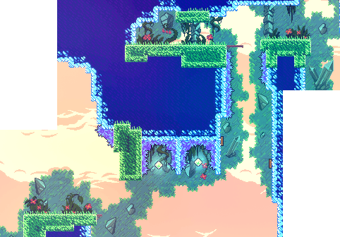
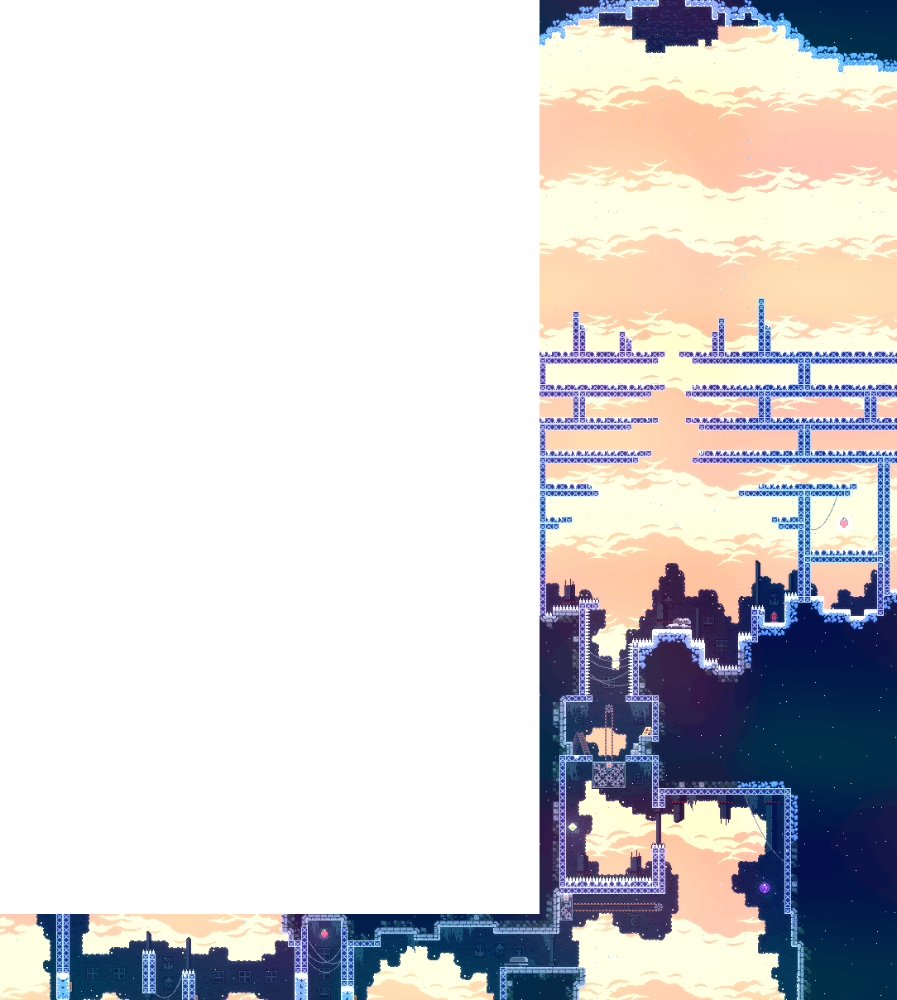

# Summit Design for Newleste.p8

This document lists and talks about possible design choices and levels that should be added in the summit chapter for the newleste.p8 project.

# What will be the levels?

## Summary

- The levels will contain demakes of loved and memorable levels from Celeste (2018).
- Custom levels will also be added.
- There will be reworks of levels from Celeste (2018).

## Key Levels from Celeste (2018)

All the images are from [Berrycamp](https://berrycamp.github.io). Check out the maps on the website for the full levels.

### Early Summit-Specific Levels

These levels will have decent amount of horizontal scrolling but can be implemented without distribution/segmentation/shortening.

### Summit-City Levels

Following levels also have some amount of vertical and horizontal scrolling but can still be implemented wihtout distribution/segmentation/shortening.

 

## Summit-Old-site Levels

C-01 and C-05, i.e. the second and the third image shown here, have significant amount of vertical scrolling in them.
This, hence, can cause a need to distribute/shorten/segment them arise but can be implemented with clever manipulation of space in the level and the levels in the carts.

 

In the following room, only the right-hand side room is to be made, the berry one. Instead of the berry, there will be a path to exit on top.

### Summit-Resort Levels

Following is a single screen level.

Following is a single screen level.

Following has a decent amount of scroll but can be implemented without too many hardships.

Following is a single screen level.

### Summit-Ridge Levels

### Summit-Reflection Levels

F-05, i.e. the second image, and the related rooms can take up a lot of space and hence might be hard to implement with other chapters.
Due to this, there arises a need to shorten, distribute and modify the rooms to fit the needs.

and the related rooms of it like f-06, 07, etc.

This level has a significant amount of vertical scrolling and hence might have to be distributed into two rooms due to the already big F-05 and related rooms.

### Summit-Specific Ending Levels

Due to the amount of scrolling required in these rooms, they are to be either shortened or be distributed if necessary.

# Chapter Arc

Just like in City chapter, the summit should start with single screen levels with minimal-to-no scrolling and then gradullay grow to long, scrolling levels.
The chapter assumes knowledge of all the mechanics and hence only a single revision-like level will be given to each mechanic to brush up the memory.
That will be followed with 2-3 levels of testing that mechanic and in the end, testing all of them together.

# Layout

The Chapter follows the same layout as the whole game.
- It starts from summit-specific level introduction.
- It then follows the game's chapter progression, city to reflection.
- Then it ends with summit-specific levels where all the mechanics from previous chapters are merged.

# Cart Layout

Due to the scope and huge amount of material the Summit level needs, it will have to be distributed into different carts, i.e. Summit will itself be a multicart.

Following is one proposal of the content distribution into multiple carts, but as the project progresses, this may be subjected to change:
- Early Summit-Specific Levels, Summit-City, Summit-Old site
- Summit-Resort, Summit-Ridge
- Summit-Reflection, Summit-Specific Ending Levels
